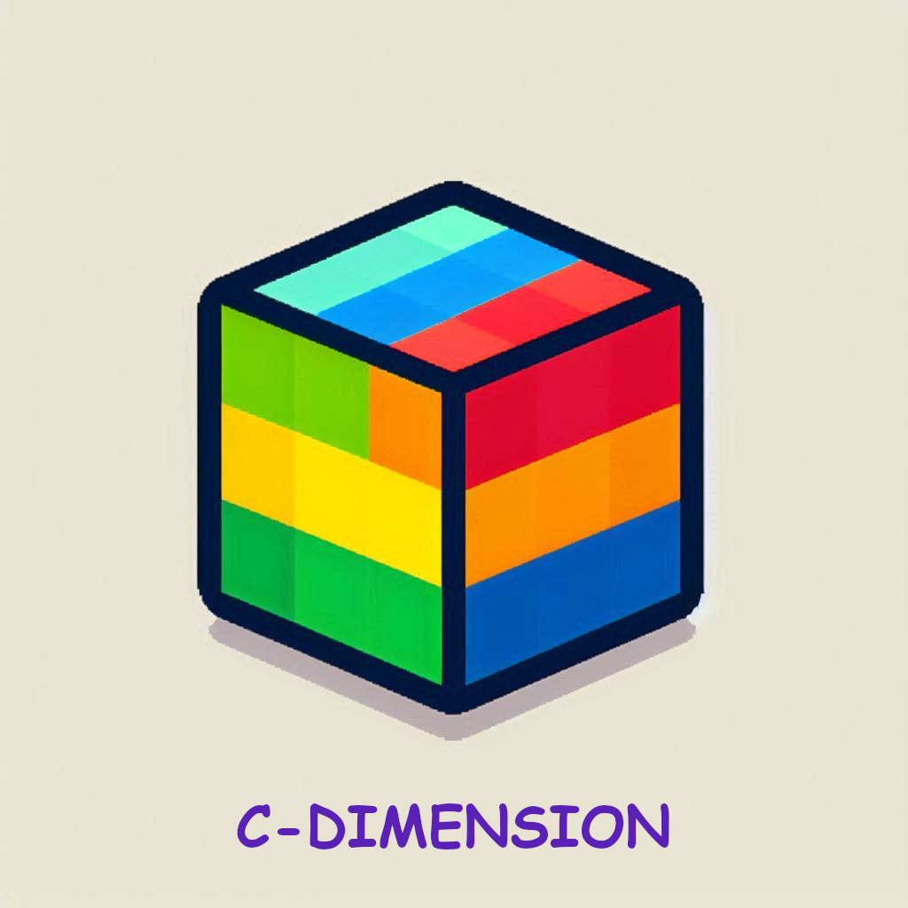

# C-DIMENSION

## Team Culius

Members of our team:
- Nguyen Si Minh - 21125081 (Leader)
- Nguyen Đinh Triet - 21125097
- Nguyen Xuan Hoa - 21125111
- Nguyen Huynh Viet Thong - 21125140

## Introduction

An simple 3D voxel puzzle-solving game, where the main character was accidently sent to a strange land where they has to get pass all the challenges to find their way home.

## Requirements

- Unity version 2022.3.17f.
- Supported platforms: Windows, WebGL.

## References

All assets, sound effects and shaders used in this project were downloaded from the following pages:

- https://alesan99.itch.io/britebot
- https://opengameart.org/content/pixel-art-wood-tiles
- https://opengameart.org/content/pixel-art-brick-tiles
- https://assetstore.unity.com/packages/3d/characters/creatures/ghost-character-free-267003
- https://sketchfab.com/3d-models/blocky-trees-pack-da28681db805440a851462fd8682b4f0
- https://github.com/Flaroon/Video-Files
- https://styloo.itch.io/dungeon-asset-pack
- https://github.com/johannesugb/VolumetricLinesUnity/tree/universal_render_pipeline
- https://piiixl.itch.io/textures
- http://gregschlom.com/devlog/2014/06/29/Poisson-disc-sampling-Unity.html
- https://assetstore.unity.com/packages/2d/textures-materials/sky/skybox-series-free-103633
- https://opengameart.org/content/bullet-decal
- https://freesound.org/people/cobratronik/sounds/117136/
- https://freesound.org/people/Erokia/sounds/427396/